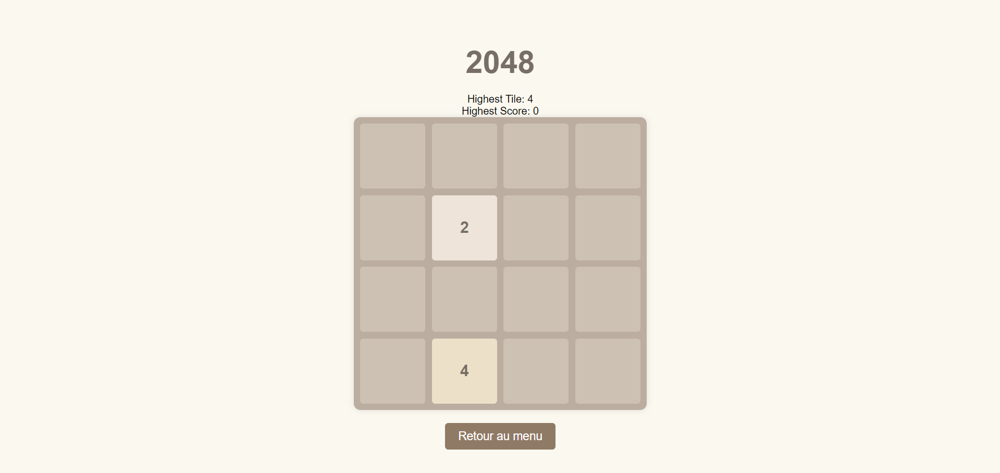
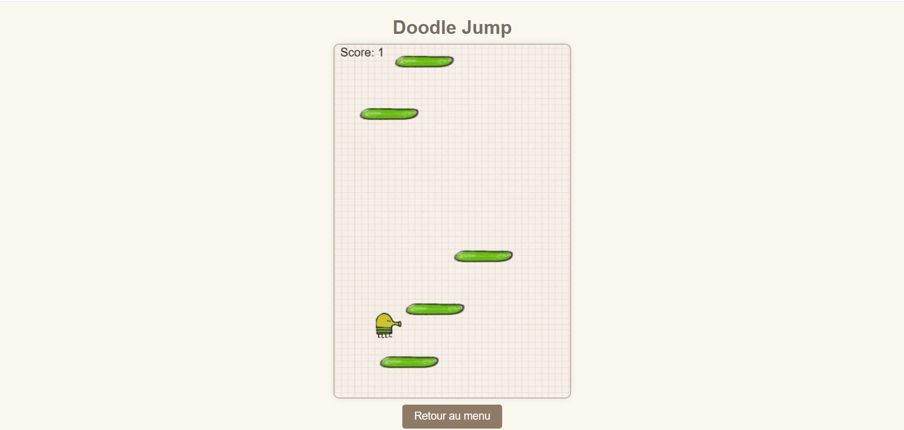
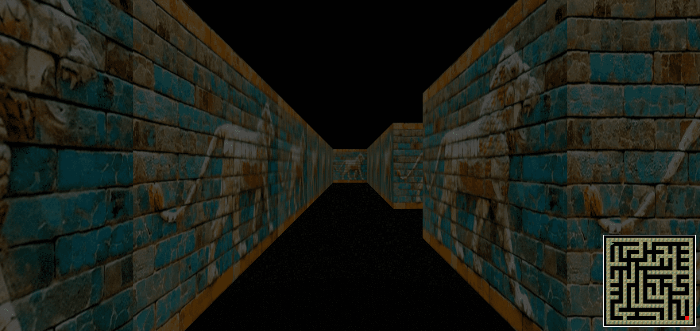
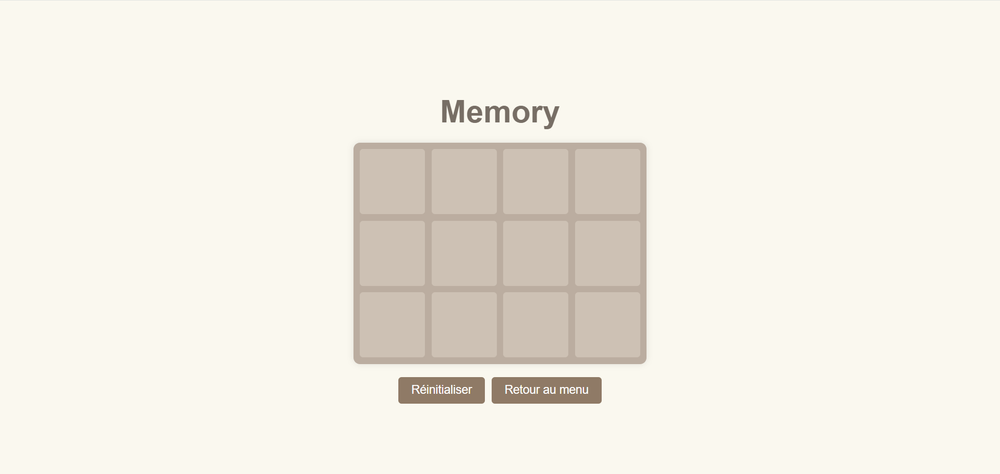
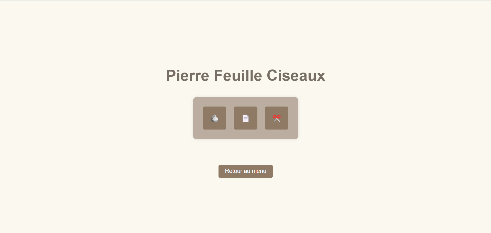
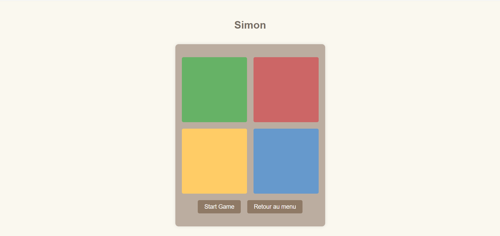
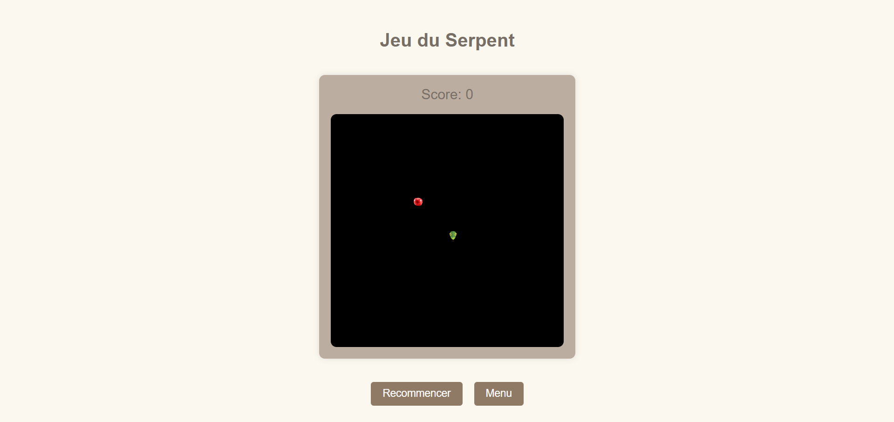
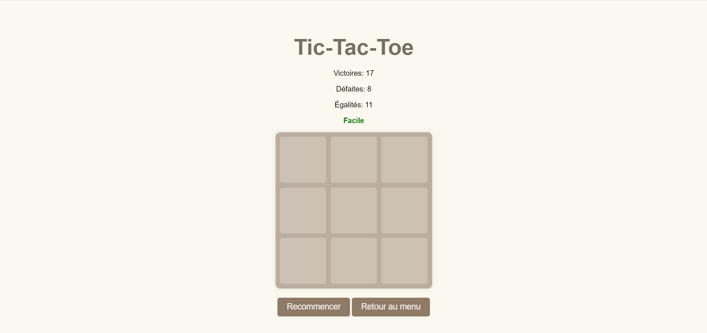

# Mini-Jeux en JavaScript

Bienvenue dans le projet **Mini-Jeux** ! Ce projet regroupe plusieurs petits jeux développés en JavaScript, HTML et CSS. Chaque jeu est accessible via un menu principal. Ce fichier README contient des instructions détaillées sur l'installation, l'utilisation et les fonctionnalités de chaque jeu inclus.

## Table des matières

1. [Aperçu des Jeux](#aperçu-des-jeux)
2. [Structure du Projet](#structure-du-projet)
3. [Installation](#installation)
4. [Utilisation](#utilisation)
5. [Jeux Inclus](#jeux-inclus)
   - [2048](#2048)
   - [Doodle Jump](#doodle-jump)
   - [Maze](#maze)
   - [Memory](#memory)
   - [Pierre-Feuille-Ciseaux](#pierre-feuille-ciseaux)
   - [Simon](#simon)
   - [Snake](#snake)
   - [Tic-Tac-Toe](#tic-tac-toe)
6. [Ressources](#ressources)
7. [Contributions](#contributions)
8. [Auteurs](#auteurs)
9. [Licence](#licence)

## Aperçu des Jeux


## Structure du Projet

Le projet est organisé comme suit :

```
Mini-Jeux/
├── ressources/
│   ├── css/
│   │   └── styles.css
│   ├── img/
│   │   ├── 2048.png
│   │   ├── doodle-jump.png
│   │   ├── maze.png
│   │   ├── memory.png
│   │   ├── pierre-feuille-ciseaux.png
│   │   ├── simon.png
│   │   ├── snake.png
│   │   └── tic-tac-toe.png
│   └── js/
│       └── instructions.js
├── src/
│   ├── 2048/
│   │   ├── 2048.css
│   │   ├── 2048.html
│   │   └── 2048.js
│   ├── doodle-jump/
│   │   ├── doodle-jump.css
│   │   ├── doodle-jump.html
│   │   └── doodle-jump.js
│   ├── maze/
│   │   ├── maze.css
│   │   ├── maze.html
│   │   └── maze.js
│   ├── memory/
│   │   ├── memory.css
│   │   ├── memory.html
│   │   └── memory.js
│   ├── pierre-feuille-ciseaux/
│   │   ├── pierre-feuille-ciseaux.css
│   │   ├── pierre-feuille-ciseaux.html
│   │   └── pierre-feuille-ciseaux.js
│   ├── simon/
│   │   ├── simon.css
│   │   ├── simon.html
│   │   └── simon.js
│   ├── snake/
│   │   ├── snake.css
│   │   ├── snake.html
│   │   └── snake.js
│   └── tic-tac-toe/
│       ├── tic-tac-toe.css
│       ├── tic-tac-toe.html
│       └── tic-tac-toe.js
├── index.html
└── README.md
```

## Installation

### Pré-requis

- Un navigateur web moderne (Chrome, Firefox, Edge, Safari, etc.)
- Git (pour cloner le dépôt)

### Étapes

1. Clonez le dépôt :
   ```bash
   git clone https://ytrack.learn.ynov.com/git/tenzo/mini-jeux-js
   ```
2. Accédez au dossier du projet :
   ```bash
   cd mini-jeux
   ```
3. Ouvrez le fichier `index.html` dans votre navigateur pour accéder au menu principal des jeux.

## Utilisation

### Accéder au Menu Principal

Ouvrez le fichier `index.html` dans votre navigateur. Vous verrez un menu avec des boutons pour chaque jeu. Cliquez sur le bouton du jeu que vous souhaitez jouer.

### Instructions de Jeu

Chaque jeu a des instructions spécifiques affichées lorsque vous y accédez. Les instructions sont également détaillées ci-dessous pour chaque jeu.

## Jeux Inclus

### 2048



**Description :** Le jeu 2048 est un jeu de puzzle dans lequel vous devez combiner des tuiles pour atteindre la tuile 2048.

**Instructions :**

- Utilisez les touches fléchées pour déplacer les tuiles.
- Lorsque deux tuiles avec le même numéro se touchent, elles fusionnent en une seule.

**Technologies :** HTML, CSS, JavaScript

### Doodle Jump



**Description :** Doodle Jump est un jeu où vous contrôlez un personnage qui saute de plateforme en plateforme.

**Instructions :**

- Utilisez les touches fléchées gauche et droite pour déplacer le joueur.
- Sautez sur les plateformes pour atteindre de nouvelles hauteurs et éviter de tomber.

**Technologies :** HTML, CSS, JavaScript

### Maze



**Description :** Maze est un jeu de labyrinthe en 3D où vous devez trouver la sortie.

**Instructions :**

- Utilisez les touches `Z`, `Q`, `S`, `D` ou les flèches pour vous déplacer dans le labyrinthe.
- Évitez les murs et collectez tous les objets pour gagner.

**Technologies :** HTML, CSS, JavaScript, Three.js

### Memory



**Description :** Memory est un jeu où vous devez trouver toutes les paires de cartes correspondantes.

**Instructions :**

- Cliquez sur les cartes pour les retourner et trouver les paires correspondantes.
- Trouvez toutes les paires pour gagner le jeu.

**Technologies :** HTML, CSS, JavaScript

### Pierre-Feuille-Ciseaux



**Description :** Pierre-Feuille-Ciseaux est un jeu classique où vous jouez contre l'ordinateur.

**Instructions :**

- Cliquez sur le bouton pierre, feuille ou ciseaux pour faire votre choix.
- Essayez de battre l'ordinateur !

**Technologies :** HTML, CSS, JavaScript

### Simon



**Description :** Simon est un jeu de mémoire où vous devez répéter une séquence de couleurs.

**Instructions :**

- Regardez la séquence de couleurs et répétez-la en cliquant sur les boutons dans le même ordre.
- Chaque tour ajoute une nouvelle couleur à la séquence.

**Technologies :** HTML, CSS, JavaScript

### Snake



**Description :** Snake est un jeu où vous contrôlez un serpent qui grandit en mangeant des fruits.

**Instructions :**

- Utilisez les touches fléchées pour contrôler le serpent.
- Le serpent grandit en mangeant des fruits. Le jeu se termine si le serpent se mord ou touche les bords.

**Technologies :** HTML, CSS, JavaScript

### Tic-Tac-Toe



**Description :** Tic-Tac-Toe est un jeu où vous jouez contre l'ordinateur pour aligner trois marques.

**Instructions :**

- Cliquez sur une case pour placer votre marque (X ou O).
- Le premier joueur à aligner trois marques gagne.

**Technologies :** HTML, CSS, JavaScript

## Ressources

Les images et scripts utilisés dans les jeux se trouvent dans le dossier `ressources`.

## Contributions

Les contributions sont les bienvenues ! Si vous souhaitez ajouter un nouveau jeu ou améliorer les jeux existants, veuillez suivre ces étapes :

1. Fork le dépôt.
2. Créez une branche pour votre fonctionnalité (`git checkout -b feature/nouvelle-fonctionnalité`).
3. Committez vos changements (`git commit -m 'Ajouter une nouvelle fonctionnalité'`).
4. Poussez la branche (`git push origin feature/nouvelle-fonctionnalité`).
5. Ouvrez une Pull Request.

## Auteurs

- [Enzo Turpin](https://github.com/EnzoTurpin)
- [Daryl Matro](https://ytrack.learn.ynov.com/git/mmahugno)
